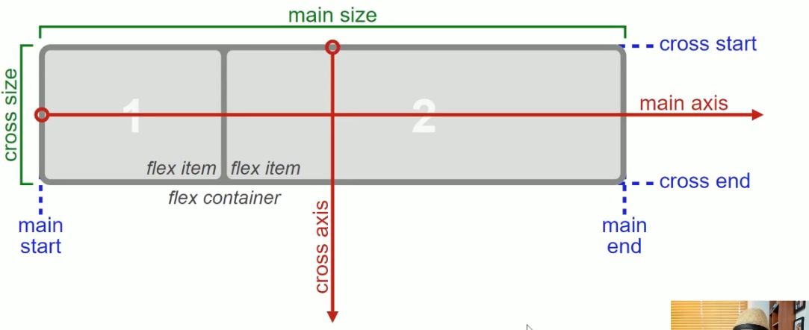
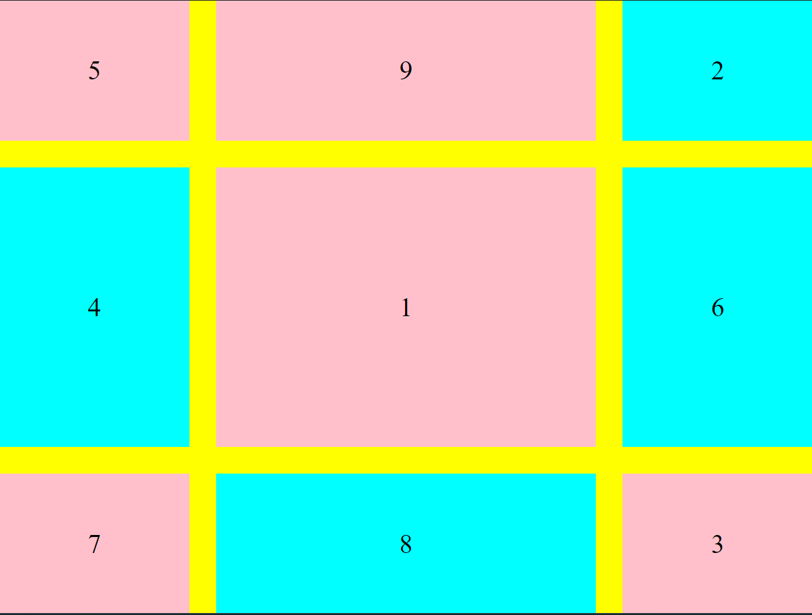
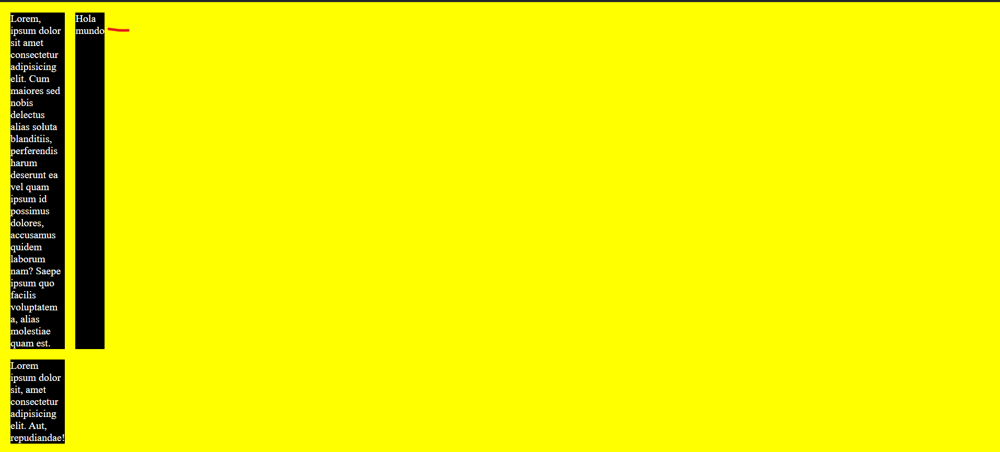
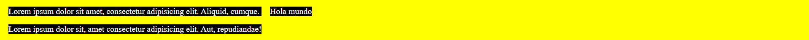
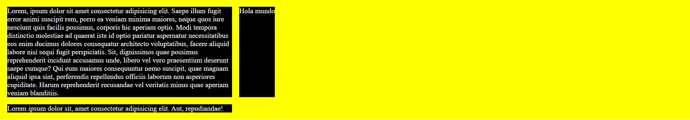

# Flexbox y CSS Grid
>Aputnes en https://workflowy.com/s/TvW.67XF5QeKGm#/67629008aec2

## Flexbox

### Flex container

#### ¿Qué es layout?
El **layout** es geometría que indica en que lugar va cada elemento en pantalla.


#### Main Axis y Cros Axis



#### Display
En **flexbox** podemos poner la propiedad `display` con el valor *flex* o *inline-flex*.

La diferencia entre ambos valores solo afecta al contenedor padre.

El valor *flex-inline* hace que nuestro contenedor se comporte como un elemento inline *(Solo abarca el ancho que necesita sus hijos)*


#### flex-direction
Determina la dirección del **main-axis** y el **cros-axis** se alineará respecto al él:

`flex-direction: row | row-reverse | column | column-reverse`

#### flex-wrap
Nos indica para saltar de línea para evitar que los componentes hijo se compriman cuando no haya espacio en el **main-axis**

La propiedad **flex-wrap** tiene los valores `wrap | wrap-reverse | nowrap`


Donde:

* `nowrap`. Es el valor por defecto
* `wrap`. Hace que los elementos hijos salten a una nueva linea cuando el ancho o alto ya no caben.
* `wrap-reverse`. Te pone la líneas de lado opuesto.


#### flex-flow
Es un *shorthand* para el uso de las propiedades **flex-direction** y el **flex-wrap** en una sola propiedad así:

`flex-flow: flex-direction flex-wrap` -> `flex-flow: column wrap-reverse;`


#### Alineaciones:

##### justify-content
Alinea los items en el eje principal (main axis)

`justify-content: flex-start | flex-end | center | space-between | space-around | space-evenly`


##### align-items
Alinea los items en el eje secundario (cros axis) dentro de la línea

`align-items: flex-start | flex-end | center | baseline | stretch`

##### align-content
Alinea las líneas respecto al conteiner

`align-content: flex-start | flex-end | center | space-between | space-around | space-evenly | stretch`


### Flex items
Son los hijos directos del **flex-container** *(También pueden ser el texto y los pseudoelementos)*

Pero los hijos directos que tengan el `position` con el valor **absolute** o **fixed**, estos no participarán en el flujo de flexbox.

### flex-grow
Es la propiedad que permite que los *flex-items** crezcan

**flex-grow** indica el factor de crecimiento, el navegador divide el espacio disponible entre la cantidad total de factores de crecimiento y se los asigna a los items.


### flex-shrink
Es la propiedad que permite que los **flex-items** se reduzcan, es lo mismo que el **flex-grow** pero a la inversa.


### flex-basis
Define el tamaño inicial en el *(main-axis)*


### shortand flex
Es un **shortand** para las propiedad **flex-grow**, **flex-shrink** y **flex-basis** en una propiedad asi:

`flex: flex-grow flex-shrink flex-basis` -> `flex: 1 1 0`;

la propiedad **flex** tiene algunos valores por defecto:

* initial (0 1 auto)
* auto (1 1 auto)
* none (0 0 auto)
* n (n 0 0) n = cualquier numero positivo


### align-self
Con esta propiedad puedes alinear un flex-item específico

`align-self: auto | flex-start | flex-end | center | baseline | stretch`


### order
Permite poner un flex-item en el lugar tú quieras sin importar la cascada de HTML.

Por defecto los *flex-items* tiene un order con valor **0**


## GRID

### Grid container
**flexbox** permite organizar elementos *(layout)* a lo largo de un solo eje *(main-axis)*, si bien tiene dos ejes pero solo es para la alineación. Para layout es solo uno.


**CSS GRID** permite construir layouts a través de dos ejes *(horizontal y vertical | inline y block)*. Con **CSS GRID** no importar la posición de un elemento en el código HTML para construir el layout.

Al igual que **Flexbox** requiere una relación de padre *(grid-container)* a hijos *(grid-items).*


### Terminologías y elementos

#### Elementos del DOM
* `grid-container`- Es al elemento que le asignemos la propiedad `display: grid | inline-grid`
* `grid-items` - Son los hijos directos de un `grid-container`, también lo son:
  * Elementos HTML
  * Pseudoelementos `::before` y `::after`
  * Textos

#### No existen en el DOM, el navegador los crea para posicionar y alinear elementos
* `grid-tracks` - Son las filas y columnas
* `grid-cells` - Se encuentra a los lados de los `grid-tracks`, izquierda y derecha para las columnas y arriba y abajo para las filas.
* `grid-cells` - Es la intesección entre una fila y una columna.
* `grid-areas` - Es cualquier área retangular delimitada por 4 `grid-lines`


### Propiedad gap y unidad fr
La propiedad `gap` nos permita asignar una separación entre una `grid-cell`


### Posicionar grid-items
Para posicionar los `grid-items` dentro de un `grid-container` se utiliza las propiedades

`grid-row-start` - `grid-cell` horizontal donde inicia el elemento
`grid-row-end` - `grid-cell` horizontal donde finaliza el elemento
`grid-column-start` - `grid-cell` vertical donde inicia el elemento
`grid-column-end` - `grid-cell` vertial donde finaliza el elemento

Por ejemplo:
>Tenemos este Código HTML
```
<div class="container">
  <div class="item">1</div>
  <div class="item">2</div>
  <div class="item">3</div>
  <div class="item">4</div>
  <div class="item">5</div>
  <div class="item">6</div>
  <div class="item">7</div>
  <div class="item">8</div>
  <div class="item">9</div>
</div>
```

>Tenemos este código CSS
```
.container {
  background-color: yellow;
  height: 100vh;
  font-size: 2em;
  display: grid;
  grid-template-columns: 1fr 2fr 1fr;
  grid-template-rows: 1fr 2fr 1fr;
  gap: 1em;
}

.item {
  background-color: pink;
  display: flex;
  justify-content: center;
  align-items: center;
}

.item:nth-child(even) {
  background-color: aqua;
}

.item:nth-child(1) {
  grid-row-start: 2;
  grid-column-start: 2;
}

.item:nth-child(3) {
  grid-column-start: 3;
  grid-row-start: 3;
}

.item:nth-child(5) {
  grid-row-start: 1;
}

.item:nth-child(9) {
  grid-column-start: 2;
  grid-row-start: 1;
}
```

> El resultado es



`grid-row-start` y `grid-row-end` tiene un shorthand que es `grid-row: grid-row-start / grid-row-end`, también `grid-column-start` y `grid-column-end` tiene un shortand que es `grid-column: grid-column-start / grid-column-end`


### Grid items

#### Tracks flexiblex con fr
La restricción para la unidad **fr** es que nunca puede ser menos que el menor contenido.

Esto sucede que los fr no pueden minimizarse más de lo que mide el contenido, por eso los tamaños son variables en cada item.

#### Track flexibles con min-content, max-content y fit-conte
Los track también pueden ser flexibles por el contenido gracias al `min-content` *(que toma el contenido minimo)* y al `max-content` *(que toma el contenido máximo)*

Ejemplo de `min-content`:

> Este es el código HTML
```
<div class="container">
  <div class="item">
    Lorem, ipsum dolor sit amet consectetur adipisicing elit. Cum maiores sed nobis delectus alias soluta blanditiis, perferendis harum deserunt ea vel quam ipsum id possimus dolores, accusamus quidem laborum nam? Saepe ipsum quo facilis voluptatem a, alias molestiae quam est.
  </div>
  <div class="item">
    Hola mundo
  </div>
  <div class="item">
    Lorem ipsum dolor sit, amet consectetur adipisicing elit. Aut, repudiandae!
  </div>
</div>
```

> Este es el código CSS con `min-content`
```
.container {
  padding: 1rem;
  background-color: yellow;
  display: grid;
  
  /* Creamos dos columnas con el contenido mínimo */
  grid-template-columns: min-content min-content;
  gap: 1rem;
}

.item {
  background-color: black;
  color: #fff;
}
```

> Este es el resultado:



Ejemplo de `max-content`:

> Este es el código HTML
```
<div class="container">
  <div class="item">
     Lorem ipsum dolor sit amet, consectetur adipisicing elit. Aliquid, cumque.
  </div>
  <div class="item">
    Hola mundo
  </div>
  <div class="item">
    Lorem ipsum dolor sit, amet consectetur adipisicing elit. Aut, repudiandae!
  </div>
</div>
```

> Este es el código CSS con `max-content`
```
.container {
  padding: 1rem;
  background-color: yellow;
  display: grid;
  
  /* Creamos dos columnas con el contenido máximo */
  grid-template-columns: max-content max-content;
  gap: 1rem;
}

.item {
  background-color: black;
  color: #fff;
}
```

> Este es el resultado:



También existe un valor llamado `fit-content()` donde por defecto el tamaño mínimo del track es `min-content` pero tú le puedes dar hasta que tamaño máximo puede aumentar el track como por ejemplo:
`grid-template-column: fit-content(500px) fit-content(500px)`

> Este es el código HTML
```
<div class="container">
  <div class="item">
    Lorem, ipsum dolor sit amet consectetur adipisicing elit. Saepe illum fugit error animi suscipit rem, porro ea veniam minima maiores, neque quos iure nesciunt quis facilis possimus, corporis hic aperiam optio. Modi tempora distinctio molestiae ad quaerat iste id optio pariatur aspernatur necessitatibus eos enim ducimus dolores consequatur architecto voluptatibus, facere aliquid labore nisi sequi fugit perspiciatis. Sit, dignissimos quae possimus reprehenderit incidunt accusamus unde, libero vel vero praesentium deserunt saepe cumque? Qui eum maiores consequuntur nemo suscipit, quae magnam aliquid ipsa sint, perferendis repellendus officiis laborum non asperiores cupiditate. Harum reprehenderit recusandae vel veritatis minus quae aperiam veniam blanditiis.
  </div>
  <div class="item">
    Hola mundo
  </div>
  <div class="item">
    Lorem ipsum dolor sit, amet consectetur adipisicing elit. Aut, repudiandae!
  </div>
</div>
```

> Este es el código CSS con `fit-content()`
```
.container {
  padding: 1rem;
  background-color: yellow;
  display: grid;
  grid-template-columns: repeat(2, fit-content(500px));
  gap: 1rem;
}

.item {
  background-color: black;
  color: #fff;
}
```

> Este es el resultado:



#### Track flexibles con minmax(), auto-fit y auto-fill

La función `minmax()` nos ayuda a tener nuestros `grid-template-columns` y `grid-template-rows` a que tenga un tamaño minimo y máximo para ordernar nuestros `grid-items`, por ejemplo:

* `grid-template-columns: minmax(200px, 500px) minmax(50px, 100px)` - Con esta propiedad le decimos que nos creen dos columnas en nuestro `grid-container` que una tenga como minimo 200px pero lo máximo que puede alcanzar esta columna son 500px y la otra que tenga como mínimo 50px pero que puede alcanzar como máximo 100px.


El valor `auto-fit` se usa en la propiedad `grid-template-columns` o `grid-template-rows` junto con la función `repeat()` para crear un diseño flexible y dinámico. auto-fit permite que la cuadrícula se ajuste automáticamente al número de elementos disponibles, llenando el espacio disponible de la manera más eficiente posible.

 el valor `auto-fill` se usa junto con la función `repeat()` en las propiedades `grid-template-columns` o `grid-template-rows` para crear un diseño de cuadrícula flexible. La función de `auto-fill` es similar a `auto-fit`, pero con una diferencia clave en cómo manejan el espacio disponible.


 ##### Diferencias entre auto-fit y auto-fill
* `auto-fit`: Ajusta las columnas o filas para llenar el espacio disponible, expandiendo los elementos para ocupar el contenedor.
* `auto-fill`: Mantiene las columnas o filas fijas para el número máximo de elementos, dejando espacios vacíos si no hay suficientes elementos para llenar el contenedor.